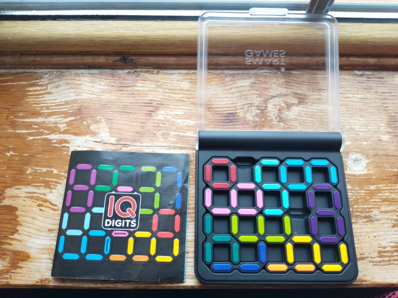

# IQ Digits Solver

IQ Digits is a puzzle game, where you have to arrange digits from 0 to 9 on a board, similar to an LCD display.
The game comes with a booklet of 120 starting configurations, and the goal is to place all the digits on the board, beginning from one of the starting configurations.

I couldn't solve the last puzzle (puzzle #120) myself, so I thought it would be fun challenge to write a program to solve it for me instead of looking up the answer.

More info about the game can be found on the [SmartGames IQ Digits website](https://www.smartgames.eu/uk/one-player-games/iq-digits).

## Setup

The solution notebook uses Python3 and `numpy`. Cells with profiling code use `line_profiler` (optional).
You can install required packages with conda/pip using `conda install numpy line_profiler`.
If you don't want to use the profiler, just comment out the lines `%load_ext line_profiler` and the ones starting with `%lprun`.

## How it works

At first it might seem like the game board is just a grid that can be represented by a 2D array.
But because pieces are placed on edges, rather than tiles, things are not so simple.
The game board has 5 rows and 5 columns of horizontal edges and 4 rows and 6 columns of vertical edges -- I chose to represent a board as 2 arrays: 5x5 and 4x6.

Digits (or Pieces) are represented the same way, except that the horizontal and vertical edge arrays are dynamic in size.

At the core, the solver uses greedy recursive depth-first search, trying all possible placements of pieces and returning straight away when a valid puzzle configuration that uses all pieces is found -- the assumption is that there is only one unique solution for each starting puzzle.

The space of all possible solutions for puzzles with few starting pieces is massive.
To reduce the memory use of puzzle states, I decided to represent each edge with just a single bit -- 0 means the space is free, 1 means it is occupied.
This also allows using fast bitwise operations to check whether a piece can be placed in a chosen spot (by looking for overlaps) and to combine a piece with a puzzle.

I also implemented some other optimisations to reduce the search space:
- We need to try all possible rotations of each digit. For some, there are 4 possible rotations, but for others, there are fewer -- e.g., '0' has only 1 unique rotation while '1' and '8' have 2. For each piece, I precomputed a set of unique rotations.
- Some digits take up more space than others (e.g., 8, 9, 6), so their possible placements are more limited. Placing these digits first allows to prune many invalid solutions.
- Memoising configurations that don't lead to any solution
- Using the profiler, I managed to reduce the overhead of all operations to the point where checking for overlap of a piece and a puzzle is the bottleneck. By precomputing a list of corners which aren't fully occupied, I significantly reduced how many times this is done. Because possible puzzle states branch out, most evaluated states are near the leaves -- when half or more of the puzzle is filled. 

## Limitations

IQ Digits has puzzles with squares where adjacent digits must sum up to a given number.
I have not implemented this.

In the original game, the pieces are coloured to distinguish between them.
I didn't implement this and so it can be hard to tell which pieces are where from the board display alone.

## Acknowledgments

This program is dedicated to my little sister who got this puzzle game as a Christmas present and shared it with me.